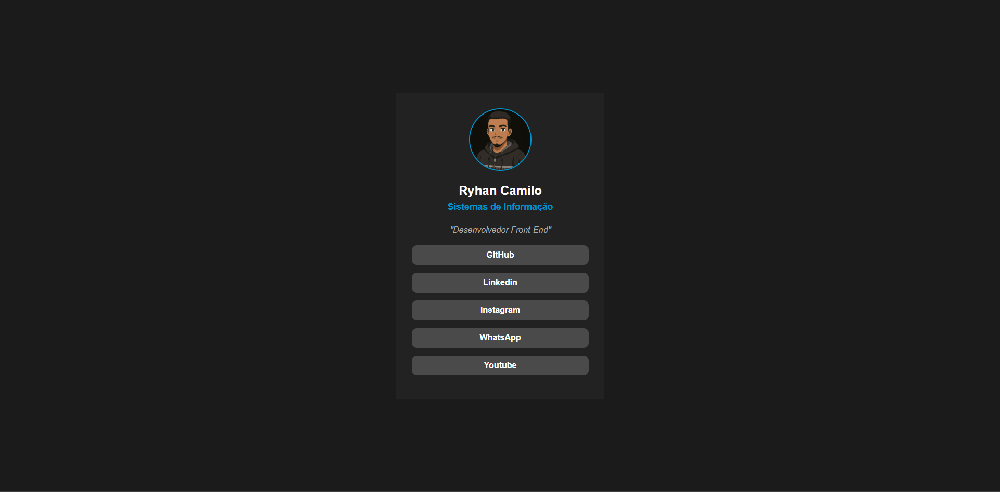

# Linktree - Ryhan 🧑‍💻



[](https://github.com/RyhZera)

---

## Descrição 📚
Página de links estilo **Linktree** para centralizar minhas redes sociais e contatos. Ideal para apresentar meus perfis online e meu portfólio de forma simples e elegante. Usando só HTML e CSS.

## Funcionalidades 📚
- Foto de perfil animado (ao passar o mouse), nome e descrição profissional.  
- Botões clicáveis para GitHub, LinkedIn, Instagram, WhatsApp e YouTube.  
- Efeitos de hover nos botões.  
- Layout **responsivo** para dispositivos móveis e desktop.

## Tecnologias Utilizadas 🛠️
- **HTML5**  
- **CSS3**  

## Como Usar
1. Clone este repositório:
```bash
git clone https://github.com/seuusuario/links-ryhan.git
```
2. Abra o arquivo **index.html** no navegador.
3. Substitua os links e a imagem de perfil pelos seus próprios, caso queira personalizar.

## Layout
- Design minimalista com cores escuras e destaque em azul.
- Estrutura simples e intuitiva, focada na experiência do usuário.

## Licença
- Este projeto está sob a MIT License

